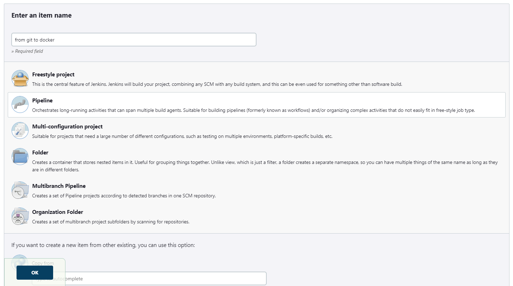
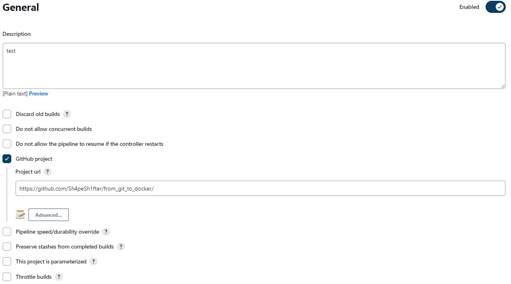
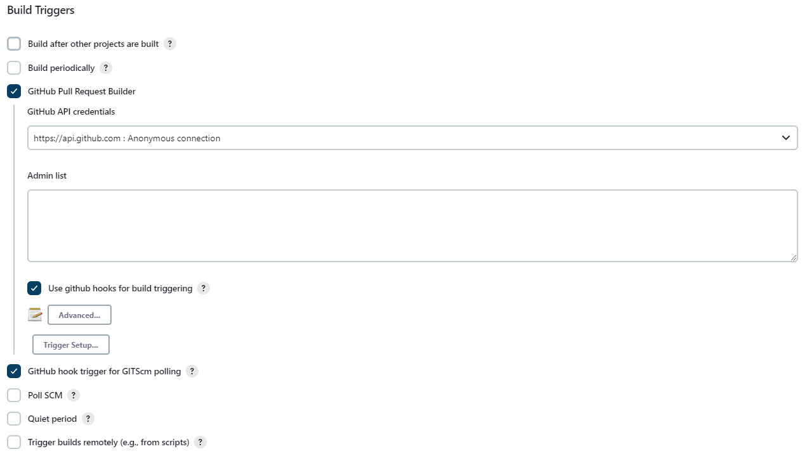
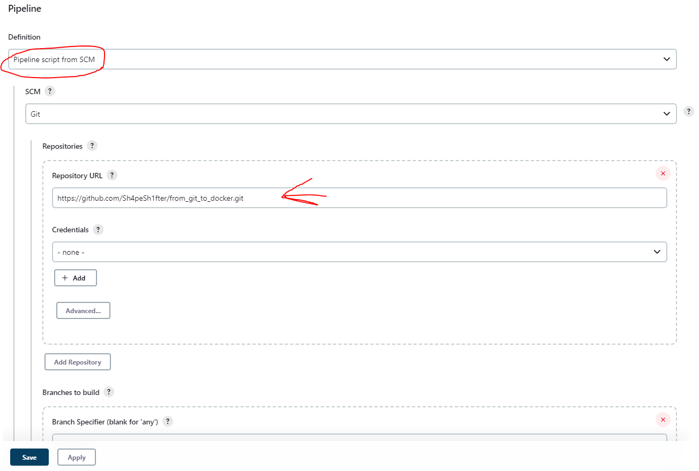
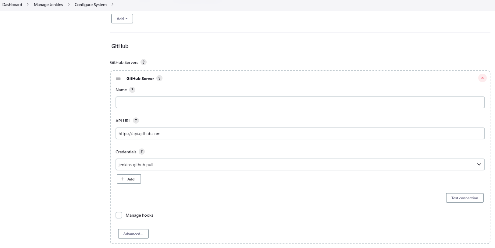
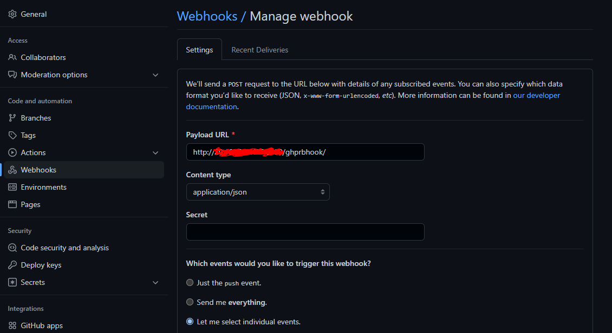

# jenkins_cicd_python_to_docker
Build and deploy jenkins container (that will serve also as the agent) that runs the python script located in the master branch, on every push request.

To start everything, just run "docker compose up" in the repository.
For configuring the jenkins and github, and creating the job itself, follow the "Usage" guide.

## Structure
```
jenkins_cicd_python_to_docker/
|
├── app/                    # app folder
|   ├── Dockerfile          # python dockerfile
|   ├── __init__.py         # 
|   ├── main.py             # the solution
|   └── test_main.py        # solution unit test
|
├── images/                 # images for the readme file
├── .gitignore              # 
├── Dockerfile              # jenkins dockerfile
├── Jenkinsfile             # jenkinsfile for the pipeline
├── README.md               # readme file
├── casc.yaml               # configuration for jenkins
├── docker-compose.yml      # docker-compose to build the images and run the containers
├── jenkins-cli.jar         # jenkins-cli
├── jenkins_plugins.txt     # the jenkins plugins that will be installed
└── test.xml                # xml of the job
```

## Getting Started
### prerequisites
First, make sure you have docker and docker-compose.
If you want to clone this repo, download and use git if you haven't already.
The dockerfile pulls image from dockerhub so also check you are connected to the internet \ to your image repo (if its your private image repo, make sure you have the image that is pulled with the same name).

### Usage
1. Clone the repo
```
git clone https://github.com/Sh4peSh1fter/jenkins_cicd_python_to_docker.git
```
2. Run the docker-compose to deploy the containers. Make sure you are in the same folder with the docker-compose.yml.
```
cd jenkins_cicd_python_to_docker
docker compose up
```
3. After the docker-compose finished successfuly, visit http://127.0.0.1:8080/, and finish the jenkins setup.
4. Create new pipeline (the name doesn't metter)

5. In the "General" section, check the "GitHub project", and enter your project's url ("https://github.com/Sh4peSh1fter/from_git_to_docker/" for this example)

6. In the "Build Triggers" check the "GitHub Pull Request Builder", there check the "use github hooks for build triggers". Also check the "GitHub hook trigger for GITScm polling" option.

7. In the "Pipeline" section, pick the "pipeline script from SCM". Under that pick "Git" as your SCM and enter the git repo you want to be connected with in the "repositoriy URL".
If the repo is public you can leave the "credentials" as none. Dont forget to save.


Now we need to configure the connection to the github for the jenkins.
1. Under the "manage jenkins" option, select "configure system". There, in the "GitHub" section, select your credentials for github if you dont have already.

2. In the same page, go to the "GitHub Pull Request Builder" section. there select the same credentials for your github, and check "Auto-manage webhooks".

Uh. The last part of the setup. Configuring the Github webhook that will be triggered only on pull (merge) requests.
1. In the github repo, go to the settings > webhooks. There add a new webhook.
The payload url should be in this format: "http://<jenkins_ip>:8080/ghprbhook/". In the "Content type" select "application/json", and on the events that will trigger the webhook, select "let me select individual events" > "pull requests".

